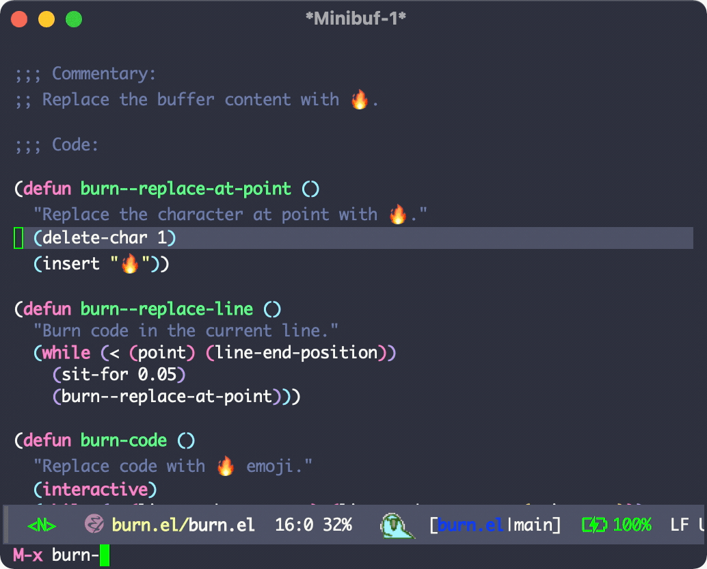

# burn.el

The fire will balance everything. It will kill any line of code, be it good or a bug.

Empty the buffer with a hot 🔥fire🔥 .



## Install

1. Cloning the repo o download `burn.el`.

2. Add this to your config

```elisp
(load "path-cloned/burn.el")

(require 'burn)
```

## Usage

`M-x burn-code`
